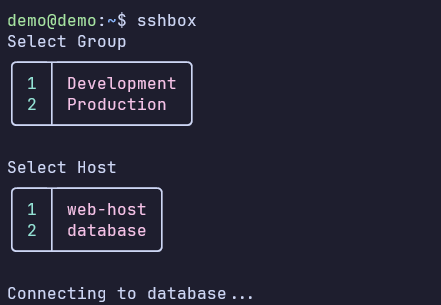

# sshbox

## Install:
`pipx install git+https://github.com/kwilt/sshbox.git`

## How To Use
- `sshbox` - connect to a host
- `sshbox add` - Add a new group or host to the configuration
- `sshbox edit` - Edit a group or host in the configuration
- `sshbox remove` - Remove a group or host from the configuration

- Config file `sshbox.json` will be created in `~/.ssh/sshbox.json` when you first run the app
  - To override this behavior, set the `SSHBOX_CONFIG_FILE` environment variable to the path of your file.

  - Example **Linux**: `export SSHBOX_CONFIG_FILE='/your/preferred/path/file_name.json'`
  - Example **Windows**: `set SSHBOX_CONFIG_FILE='/your/preferred/path/file_name.json`

